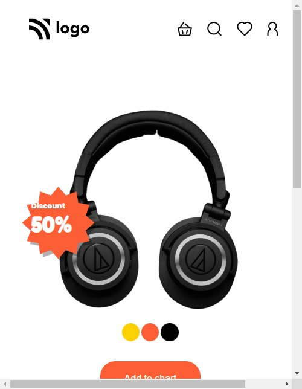
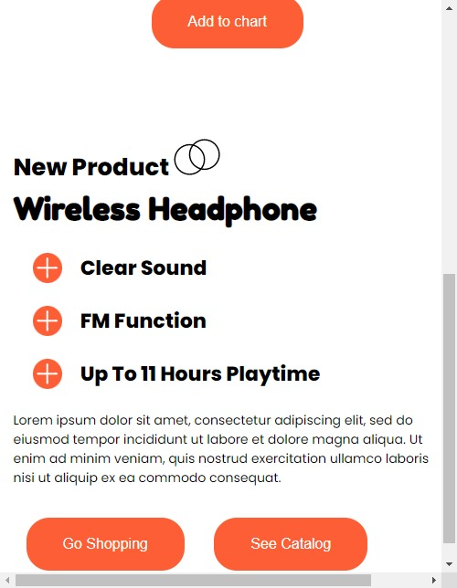

> ## Deepak Nandi

 

## Tech Stack:

---

### Checkout the live website [here](https://project07-Product.netlify.app/).

---

## My Learnings

-   Skills Gained in this project.
-   Learend about Mobile and Tablet Responsive.
-   Learned about Media queries and min and max width.
-   Learned to implement Template-column, Flex-direction and psuedo elements.

---

## How the website looks like

### Desktop Mode 
 

### Tablet Mode 

 

### Mobile Mode 
